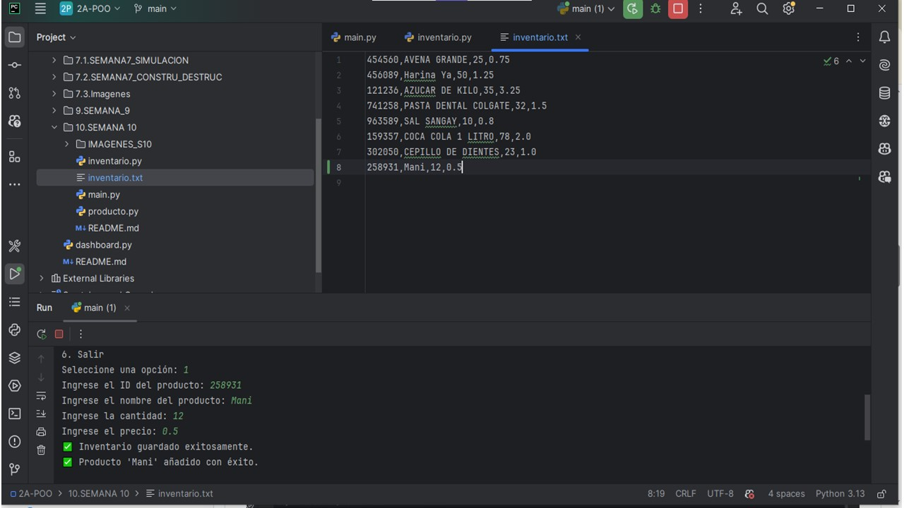
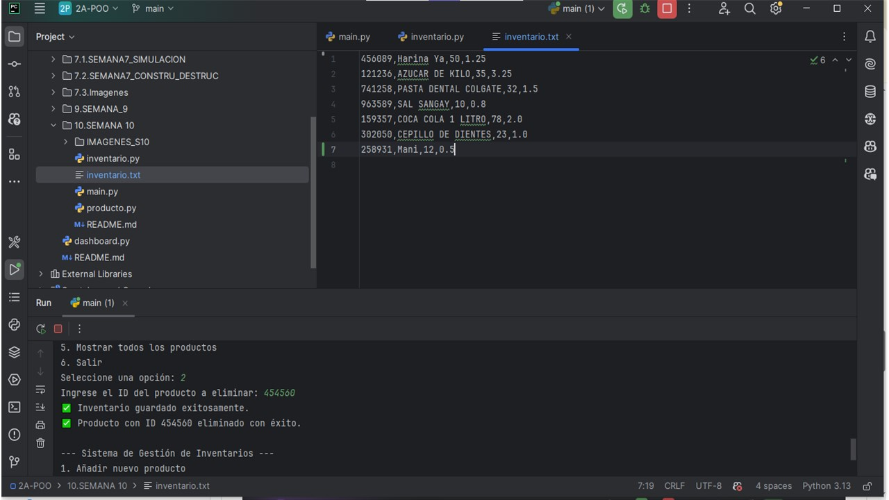

## UNIVERSIDAD ESTATAL AMAZONICA
_____
### Sistema de Gestión de Inventarios
### 2A de Programación Orientada a Objetos
### Autor: Jessica Pesantez
### Descripción del Proyecto
____

Este proyecto es un sistema de gestión de inventarios desarrollado en Python utilizando el paradigma de Programación Orientada a Objetos (POO). Permite a los usuarios gestionar el inventario de una manera eficiente, abarcando las siguientes funcionalidades:

Añadir productos: Agregar un nuevo producto al inventario con atributos como ID, nombre, cantidad y precio.

Eliminar productos: Quitar productos existentes del inventario, especificando el ID del producto.

Actualizar productos: Modificar la cantidad y/o el precio de un producto específico.

Buscar productos: Localizar productos por coincidencia en su nombre.

Mostrar inventario: Visualizar una lista completa de todos los productos almacenados.

Estructura del Proyecto
El proyecto se divide en tres módulos principales, cada uno con una responsabilidad clara, lo que facilita su mantenimiento y escalabilidad:

producto.py: Define la clase Producto, que sirve como plantilla para crear objetos individuales con sus atributos (id, nombre, cantidad, precio).

inventario.py: Define la clase Inventario, que maneja la colección de objetos Producto e implementa la lógica de negocio para las operaciones de añadir, eliminar, actualizar, buscar y mostrar.

main.py: Contiene la lógica principal del programa. Este módulo presenta un menú interactivo en la terminal que guía al usuario a través de las diferentes funcionalidades del sistema.

Capturas de Pantalla
A continuación, se muestran capturas que ilustran el flujo de trabajo del sistema en ejecución, incluyendo una vista del archivo de texto utilizado para la persistencia de datos.
___
### Menú Principal

____
### INVENTARIO CARGADO

### PRODUCTO AGREGADO EXITOSAMENTE

### PRODUCTO ACTUALIZADO EXITOSAMENTE

### PRODUCTO ELIMINADO EXITOSAMENTE

### ERROR AL INGRESAR DATOS

### ERROR AL ELIMINAR DATOS

### ERROR AL ACTUALIZAR DATOS

### MOSTRAR TODOS LOS PRODUCTOS 

