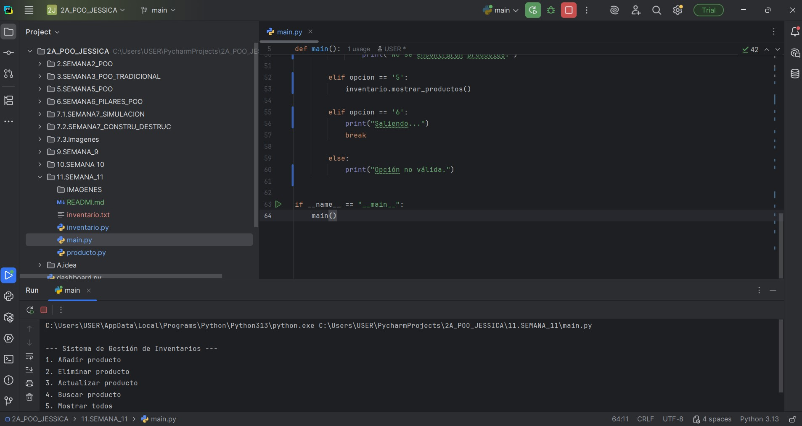
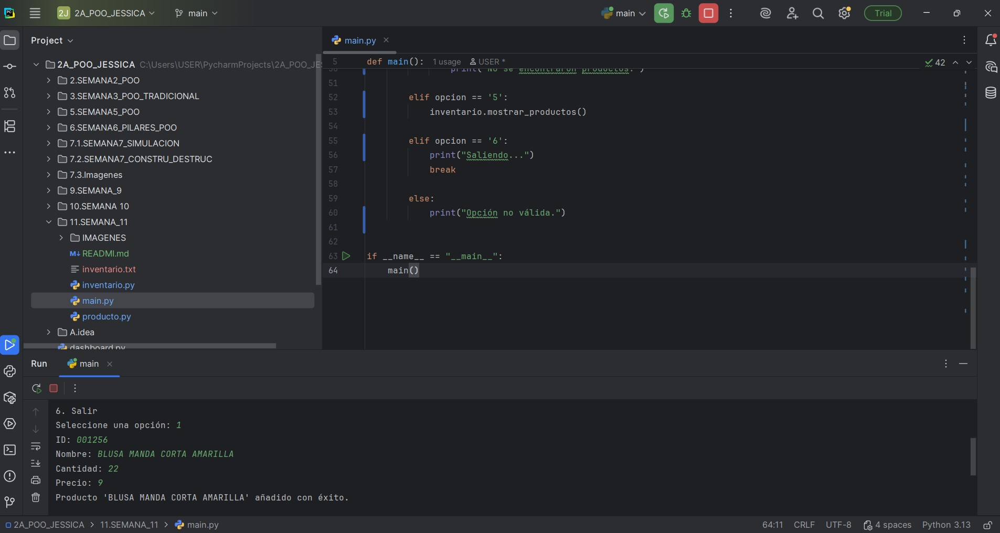
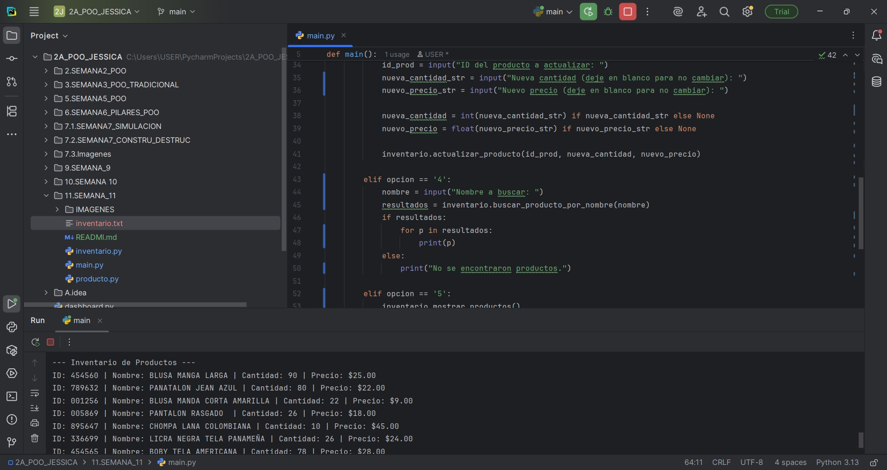
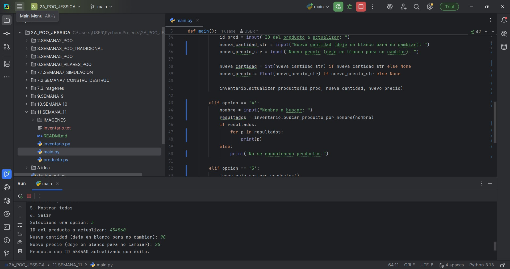
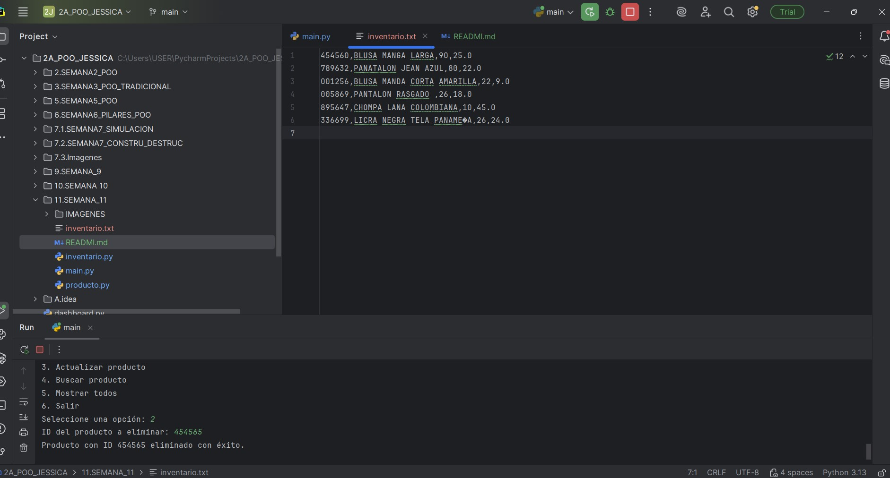
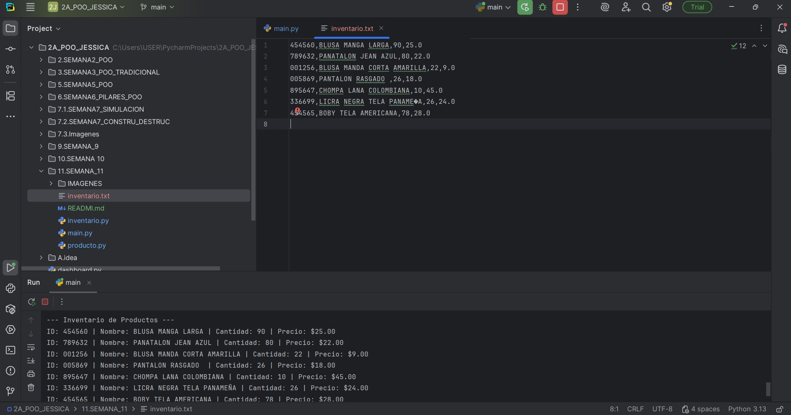

<h1 style="color:navy;">UNIVERSIDAD ESTATAL AMAZÓNICA</h1>

### 2A DE PROGRAMACIÓN ORIENTADA A OBJETOS

**AUTOR:** JESSICA PESANTEZ

-----

##  Descripción del Proyecto

Este proyecto es un **Sistema de Gestión de Inventarios** desarrollado en Python. La aplicación fue diseñada para gestionar productos de una tienda, permitiendo añadir, eliminar, actualizar, buscar y mostrar ítems del inventario de forma eficiente.

El sistema se basa en los principios de la **Programación Orientada a Objetos (POO)** y utiliza **colecciones** (específicamente un diccionario) para un manejo óptimo de los datos. Además, implementa la **persistencia de datos** al guardar y cargar la información del inventario en un archivo de texto (`inventario.txt`), asegurando que los cambios no se pierdan al cerrar el programa.

-----

## ️ Tecnologías y Características Clave

* **Python:** Lenguaje de programación principal.
* **Programación Orientada a Objetos (POO):** El código está estructurado en clases modulares (`Producto`, `Inventario`) que encapsulan la lógica y los datos.
* **Colecciones:** La clase `Inventario` utiliza un **diccionario** para almacenar productos, lo que permite un acceso y búsqueda de datos extremadamente rápidos por ID.
* **Persistencia de Datos:** El inventario se guarda automáticamente en un archivo de texto después de cada modificación importante, garantizando la durabilidad de la información entre sesiones.

-----

##  Estructura del Proyecto

El proyecto está organizado en tres archivos principales, cada uno con una responsabilidad específica:

* **`main.py`:** Es el punto de entrada del programa. Contiene la interfaz de usuario en la consola y orquesta las llamadas a los métodos de la clase `Inventario`.
* **`inventario.py`:** Contiene la clase `Inventario`, que gestiona la lógica de negocio del inventario. Utiliza un diccionario para almacenar los productos y se encarga de las operaciones de guardar y cargar archivos.
* **`producto.py`:** Define la clase `Producto`, que es la plantilla para cada ítem del inventario con sus atributos básicos (ID, nombre, cantidad, precio).

-----

##  Cómo Ejecutar el Programa

1.  Asegúrate de tener Python 3 instalado en tu sistema.
2.  Coloca los tres archivos (`main.py`, `inventario.py`, `producto.py`) en la misma carpeta.
3.  Abre una terminal o símbolo del sistema.
4.  Navega hasta la carpeta del proyecto.
5.  Ejecuta el siguiente comando:
    ```bash
    python main.py
    ```
    El menú interactivo aparecerá en la consola, y podrás comenzar a gestionar tu inventario.

-----

##  Demostración de Funcionalidades

A continuación, se presentan las capturas de pantalla que demuestran el correcto funcionamiento del sistema y el cumplimiento de los requisitos de la tarea.

### 1. Menú Principal y Carga de Datos

Esta captura muestra el menú principal del sistema al ser iniciado, confirmando que el inventario se cargó correctamente desde el archivo.



### 2. Adición de un Nuevo Producto

Aquí se observa el proceso de ingresar los datos de un nuevo producto y el mensaje de confirmación que aparece al ser añadido.



### 3. Visualización del Inventario

Esta imagen muestra el inventario completo, listando todos los productos que han sido cargados y añadidos al sistema.



### 4. Actualización de un Producto

Se demuestra cómo se puede modificar la cantidad o el precio de un producto existente, mostrando el mensaje de éxito.



### 5. Búsqueda de Productos por Nombre

Esta captura muestra la funcionalidad de búsqueda, encontrando un producto específico con solo una parte de su nombre.


### 6. Eliminación de un Producto
Esta captura muestra el proceso de eliminar un producto del inventario usando su ID, y el mensaje de confirmación que aparece al ser eliminado.



### 7. Persistencia de Datos

Finalmente, esta imagen muestra el contenido del archivo `inventario.txt` después de haber realizado varias operaciones, lo que prueba que el inventario se guarda y actualiza de forma persistente.

