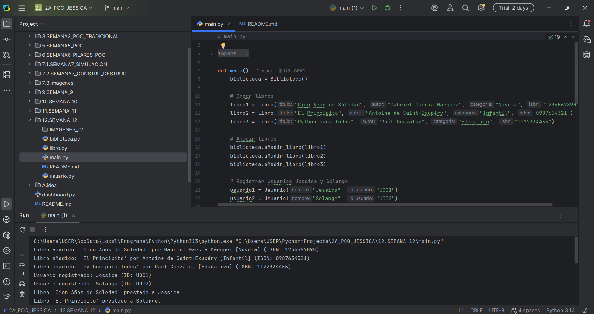
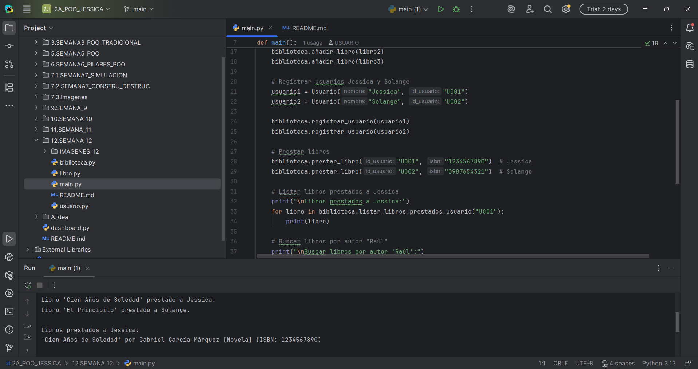
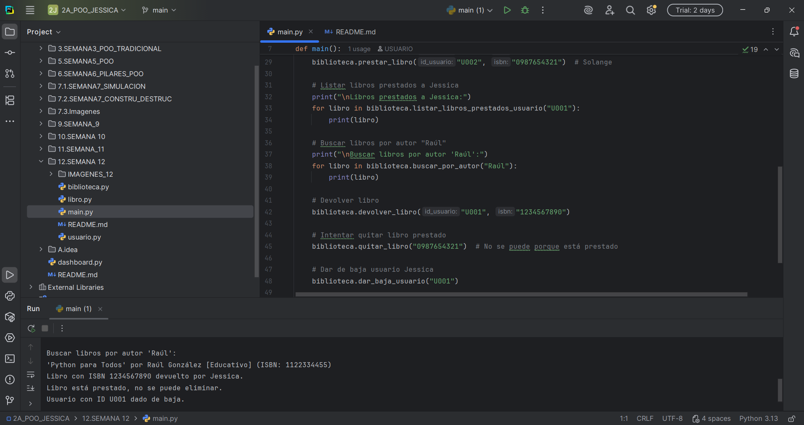

# Sistema de Gestión de Biblioteca Digital

## Universidad Estatal Amazónica  
### 2A de Tecnologías de la Información  
**Autor:** Jessica Pesantez

---

## Descripción

Sistema básico para gestionar una biblioteca digital que permite:

- Añadir y quitar libros.
- Registrar y dar de baja usuarios.
- Prestar y devolver libros.
- Buscar libros por título, autor o categoría.
- Listar libros prestados a un usuario.

---

## Archivos

- `libro.py`: Clase Libro con atributos inmutables.
- `usuario.py`: Clase Usuario con lista de libros prestados.
- `biblioteca.py`: Clase Biblioteca que gestiona todo.
- `main.py`: Script para probar funcionalidades.

---

## Uso

1. Coloca todos los archivos en una carpeta.
2. Abre la terminal en esa carpeta.
3. Ejecuta:

CAPTURAS DE PANTALLA:

1. Confirmación de que los libros fueron añadidos y los usuarios Jessica y Solange registrados.

2. Mensajes que muestran el préstamo exitoso de libros a los usuarios.

3. Listado de los libros que tiene prestados un usuario (por ejemplo, Jessica).



```bash
python main.py

