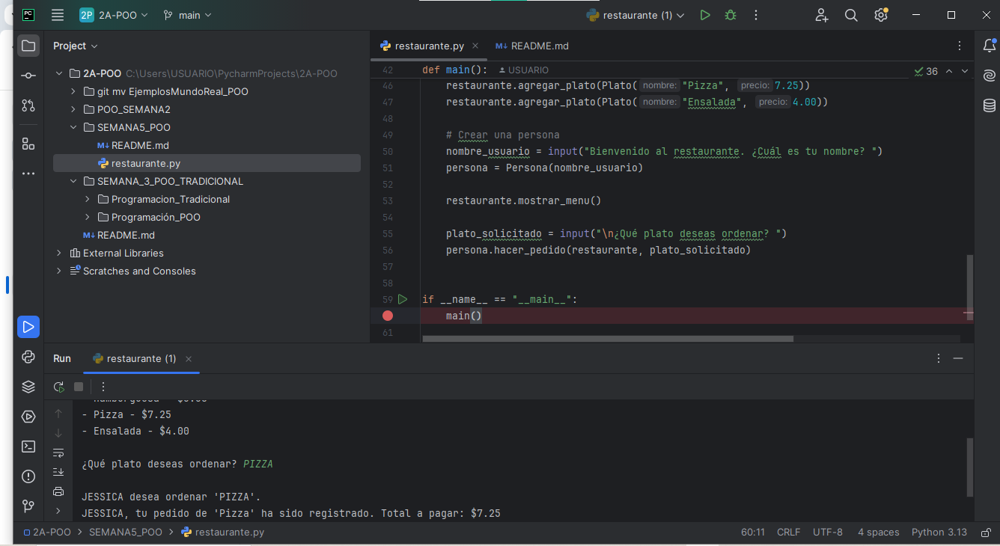

# Sistema de Pedidos de Restaurante

Este proyecto simula un sistema de pedidos en un restaurante usando POO en Python.

## Uso

- Ejecuta `restaurante.py`
- Ingresa tu nombre y el plato que deseas ordenar
- El sistema confirma tu pedido

## Autor

Jessica   Pesantez

## Ejecución del Código

