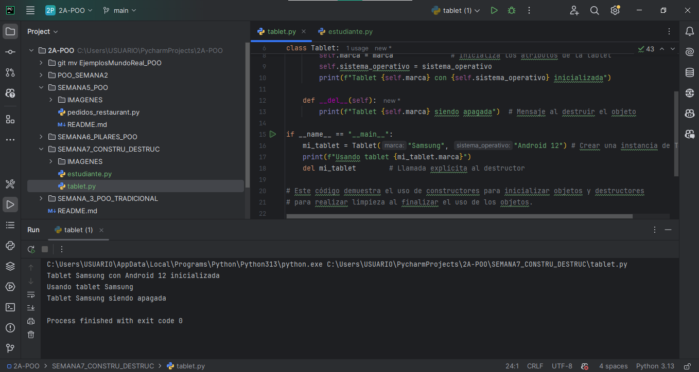

# **UNIVERSIDAD ESTATAL AMAZÓNICA**  
**Tecnologías de la Información – Segundo Semestre**  
**Ejercicios Prácticos: Constructores y Destructores en Python**  

---

##  Descripción del Proyecto
Este repositorio contiene ejercicios prácticos desarrollados para la materia **Programación Orientada a Objetos**, enfocados en el uso de **constructores (`__init__`)** y **destructores (`__del__`)** en Python. Se implementan dos clases:  

1. **`Estudiante`**: Representa un estudiante con atributos básicos (nombre, edad, carrera).  
2. **`Tablet`**: Simula una tablet con atributos como marca y sistema operativo.  

Estos ejercicios ayudan a comprender cómo **inicializar objetos** y **liberar recursos** de manera eficiente en Python.  

### **1️⃣ Clase `Estudiante` (`estudiante.py`)**  
**Atributos**:  
- Nombre (ej:Carolina Montenegro) 
- Edad  (ej:30 )
- Carrera (ej: Ingenieria en Tecnologías de la Información) 

**Funcionalidades**:  
- Constructor (`__init__`) → Registra un nuevo estudiante.  
- Método `mostrar_informacion()` → Muestra los datos del estudiante.  
- Destructor (`__del__`) → Elimina al estudiante del sistema.  

---

### **2️⃣ Clase `Tablet` (`tablet.py`)**  
**Atributos**:  
- Marca (ej: Samsung)  
- Sistema Operativo (ej: Android 12)  

**Funcionalidades**:  
- Constructor (`__init__`) → Inicializa una nueva tablet con marca y sistema operativo.  
- Destructor (`__del__`) → "Apaga" la tablet cuando se elimina del sistema.  

---

##  Captura de Codigo Estudiante.py

##  Captura de Codigo table.py

  
