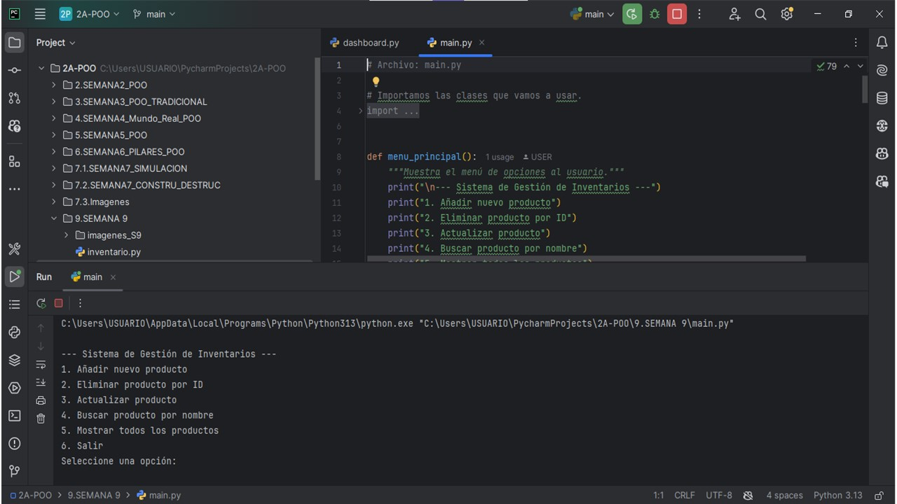
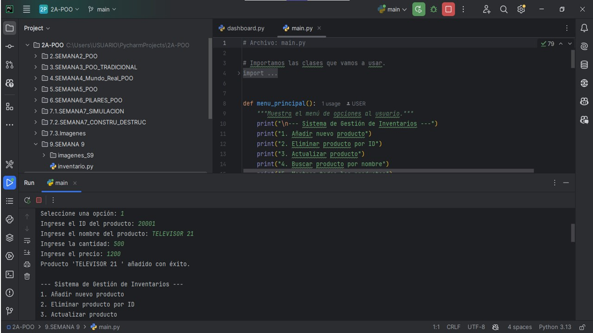
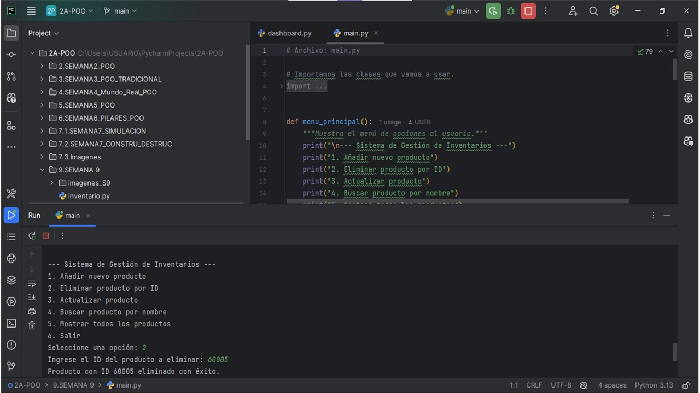
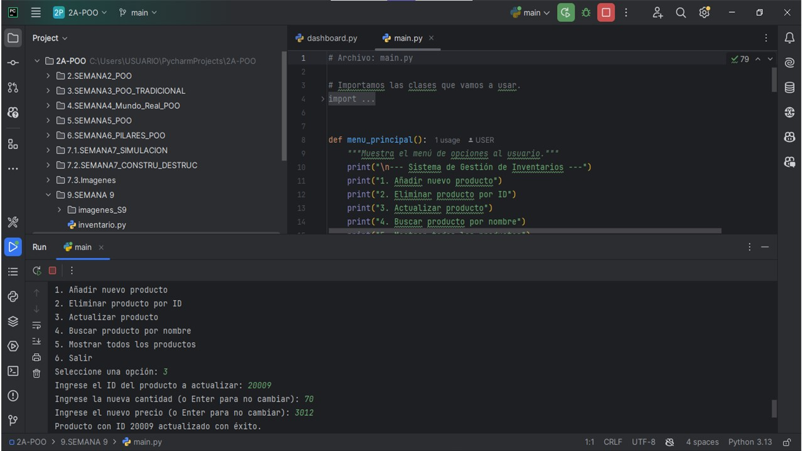
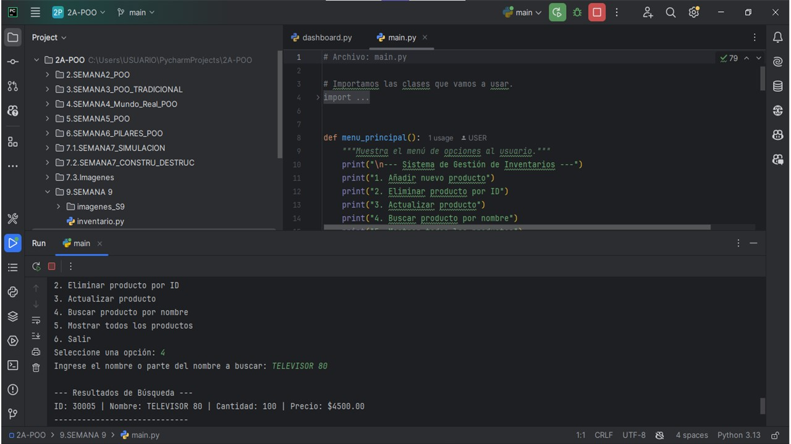
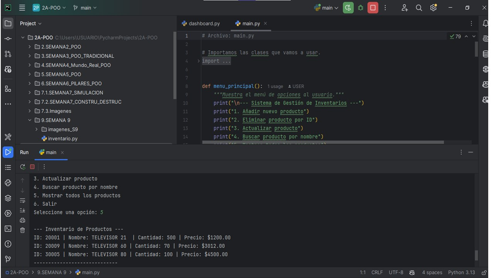
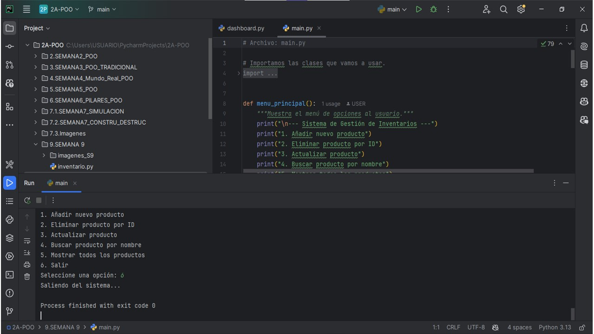

## 
____

##  UNIVERSIDAD ESTATAL AMAZONICA
### Sistema de Gestión de Inventarios

____

#### 2A de Programación Orientada a Objetos
_____
Autor: Jessica Pesantez
_____

Descripción del Proyecto
____

Este es un sistema de gestión de inventarios básico desarrollado en Python. El programa permite a los usuarios interactuar con un inventario de productos, realizando las siguientes operaciones:

Añadir productos: Agregar un nuevo producto al inventario con un ID único, nombre, cantidad y precio.

Eliminar productos: Quitar un producto existente utilizando su ID.

Actualizar productos: Modificar la cantidad y/o el precio de un producto específico.

Buscar productos: Encontrar productos por una coincidencia en su nombre.

Mostrar inventario: Visualizar la lista completa de todos los productos almacenados.
_____
El proyecto está estructurado en tres archivos principales:
_____
producto.py: Define la clase Producto, que representa un objeto individual con sus atributos (id, nombre, cantidad, precio).
_____
inventario.py: Define la clase Inventario, que gestiona la colección de objetos Producto y contiene los métodos para añadir, eliminar, actualizar, buscar y mostrar productos.
_____
main.py: Contiene la lógica principal del programa, incluyendo un menú de usuario para interactuar con las funcionalidades del inventario.
_____
Capturas de Pantalla
A continuación, se muestran tres capturas de pantalla que ilustran el funcionamiento del sistema en ejecución.
_____
--- Sistema de Gestión de Inventarios ---

1. Añadir nuevo producto

2. Eliminar producto por ID

3. Actualizar producto

4. Buscar producto por nombre

5. Mostrar todos los productos

6. Salir
