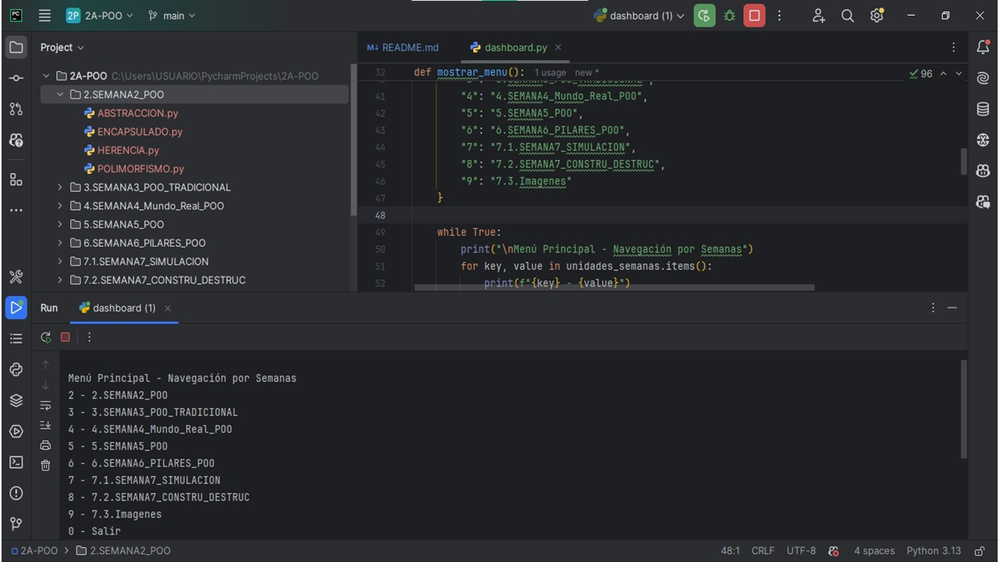
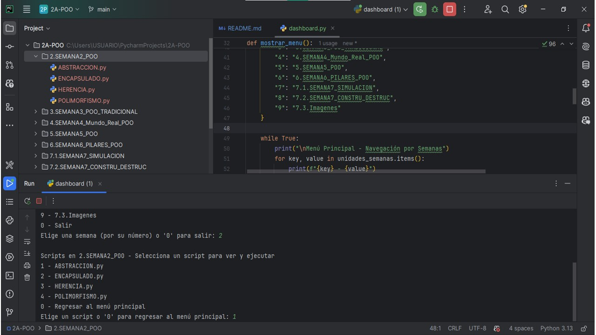
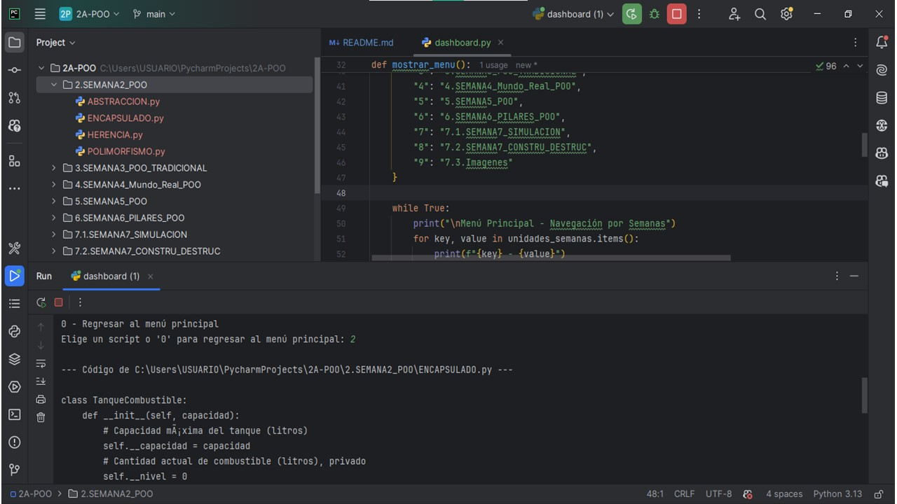

# UNIVERSIDAD ESTATAL AMAZÓNICA
## Ingeniería en Tecnologías de la Información - Semestre 2A

---

## Proyecto: Ejemplos de Programación Orientada a Objetos (POO)

Este repositorio contiene una colección de ejemplos y ejercicios de Programación Orientada a Objetos, organizados por semanas. Incluye un script `dashboard.py` para navegar, visualizar y ejecutar fácilmente estos ejemplos desde la consola.

### **Estructura del Proyecto:**

El proyecto se organiza en carpetas semanales:

## 2A-POO
2.SEMANA2_POO

3.SEMANA3_POO_TRADICIONAL

4.SEMANA4_Mundo_Real_POO

5.SEMANA5_POO

6.SEMANA6_PILARES_POO

7.1.SEMANA7_SIMULACION

7.2.SEMANA7_CONSTRU_DESTRUC

dashboard.py

README.md

---
### **Cómo Usar el Dashboard (`dashboard.py`):**

1.  **Requisitos:** Python 3.x.
2.  **Ejecución:**
    * Abre tu terminal y navega a la carpeta `2A-POO`:
      ```bash
      cd C:\Users\USUARIO\PycharmProjects\2A-POO
      ```
    * Ejecuta el dashboard:
      ```bash
      python dashboard.py
      ```
3.  **Interacción:**
    * El menú te permitirá seleccionar una semana por su número.
    * Dentro de cada semana, podrás seleccionar un script para **ver su código** o **ejecutarlo** en una nueva ventana.
    * Usa `0` para regresar al menú anterior o salir.
---
### **Capturas de Pantalla:**


(Se añadirán imágenes aquí para ilustrar el dashboard y la estructura del proyecto.)

---

---

---

---
**Autor:** Jessica Pesantez

---